# 🟢 RenewIQ

A modern full-stack subscription management platform that helps users organize subscriptions, monitor renewals, and analyze recurring expenses.

---

## ✨ Features

- 🔐 JWT Authentication
- 👤 User Registration & Login
- 📂 Automatic Default Categories
- ➕ Add, Edit & Delete Subscriptions
- 📅 Renewal Tracking
- 📊 Analytics Dashboard
- 📈 Monthly Spending Overview
- 🔍 Search Subscriptions
- 👥 Multi-user Support

---

## 🛠 Tech Stack

### Frontend
- Next.js
- React
- TypeScript
- Tailwind CSS
- shadcn/ui
- React Query

### Backend
- Node.js
- Express.js
- Prisma ORM
- JWT Authentication
- bcrypt

### Database
- PostgreSQL

## 📁 Project Structure

```text
RenewIQ
│
├── 📁 client                     # Next.js Frontend
│   │
│   ├── 📁 app
│   │   ├── analytics
│   │   ├── login
│   │   ├── register
│   │   ├── renewals
│   │   ├── settings
│   │   ├── subscriptions
│   │   ├── globals.css
│   │   ├── layout.tsx
│   │   └── page.tsx
│   │
│   ├── 📁 components
│   │   ├── auth
│   │   ├── dashboard
│   │   ├── layout
│   │   ├── subscription
│   │   └── ui
│   │
│   ├── 📁 hooks
│   │   ├── useCategories.ts
│   │   ├── useDashboard.ts
│   │   └── useSubscriptions.ts
│   │
│   ├── 📁 providers
│   │   └── QueryProvider.tsx
│   │
│   ├── 📁 services
│   │   ├── api.ts
│   │   ├── auth.service.ts
│   │   ├── category.service.ts
│   │   ├── dashboard.service.ts
│   │   └── subscription.service.ts
│   │
│   ├── 📁 lib
│   │   └── utils.ts
│   │
│   ├── package.json
│   └── tsconfig.json
│
├── 📁 server                     # Express Backend
│   │
│   ├── 📁 prisma
│   │   ├── migrations
│   │   ├── schema.prisma
│   │   └── seed.ts (optional)
│   │
│   ├── 📁 src
│   │   ├── config
│   │   ├── controllers
│   │   ├── middleware
│   │   ├── routes
│   │   ├── services
│   │   ├── utils
│   │   ├── validators
│   │   ├── types
│   │   └── server.ts
│   │
│   ├── package.json
│   └── tsconfig.json
│
├── 📄 README.md
├── 📄 .gitignore

```

## 📸 Screenshots

### 📝 Register
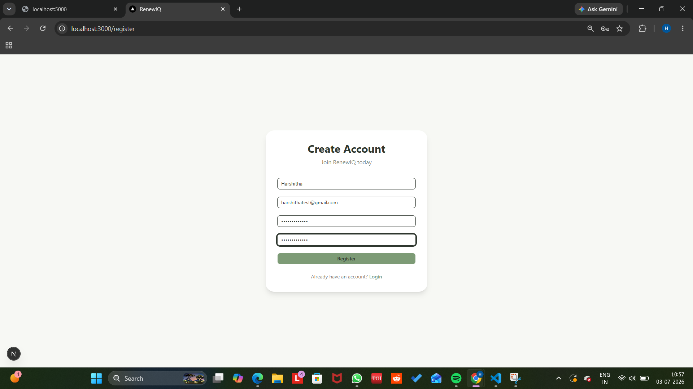

---

### 🔐 Login
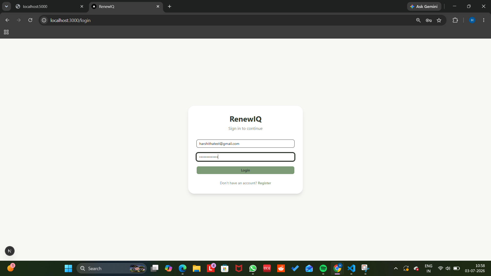

---

### 📊 Dashboard (Before Adding Subscriptions)
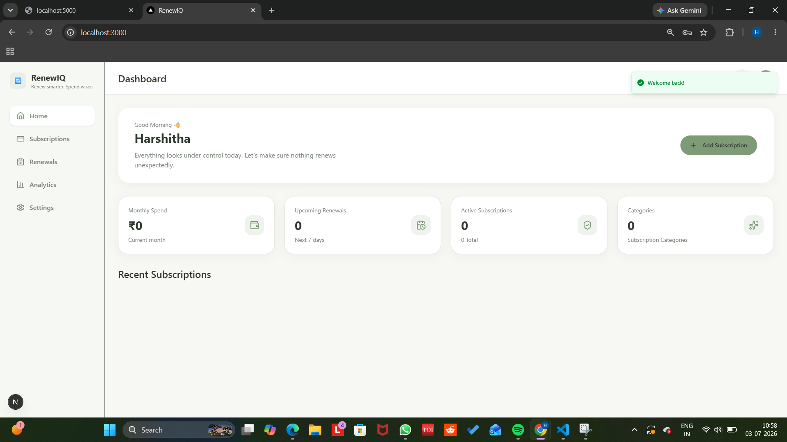

---

### 📂 Subscriptions
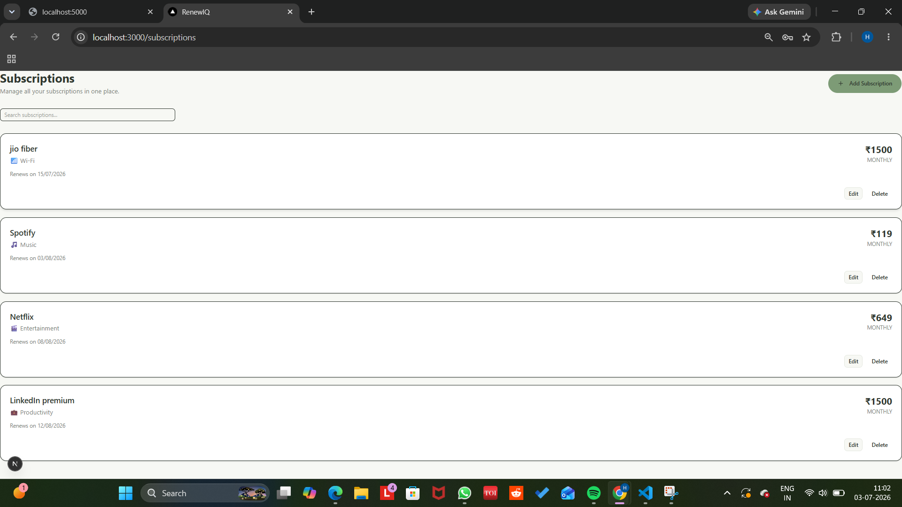

---

### ➕ Add Subscription
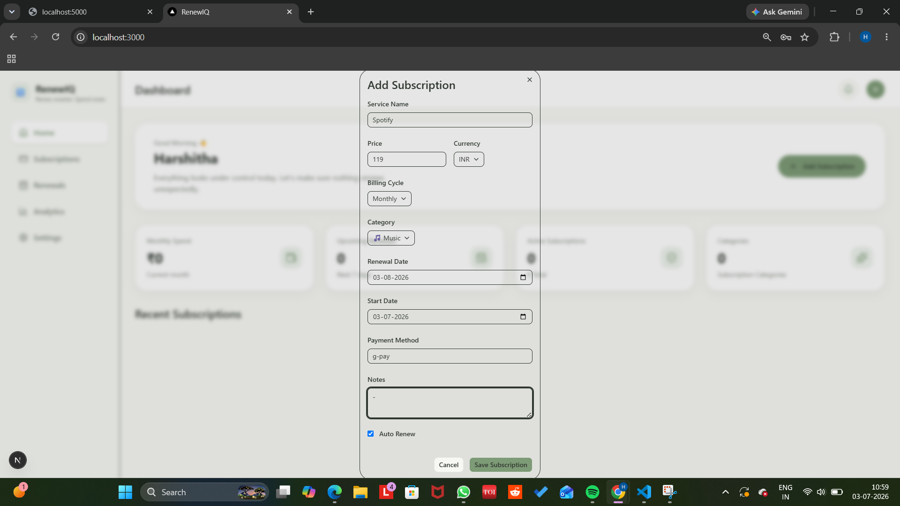

---

### ✏️ Edit Subscription
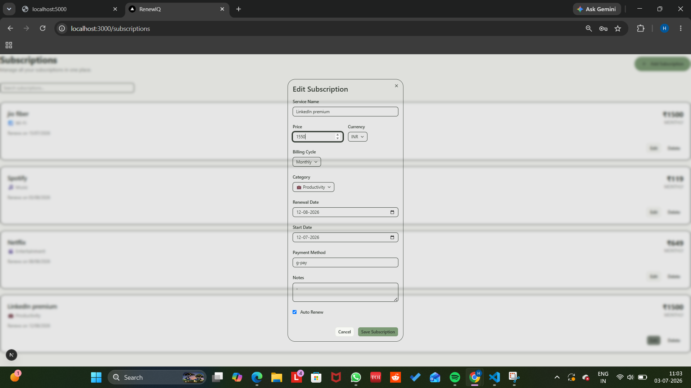

---

### 📊 Dashboard (After Adding Subscriptions)
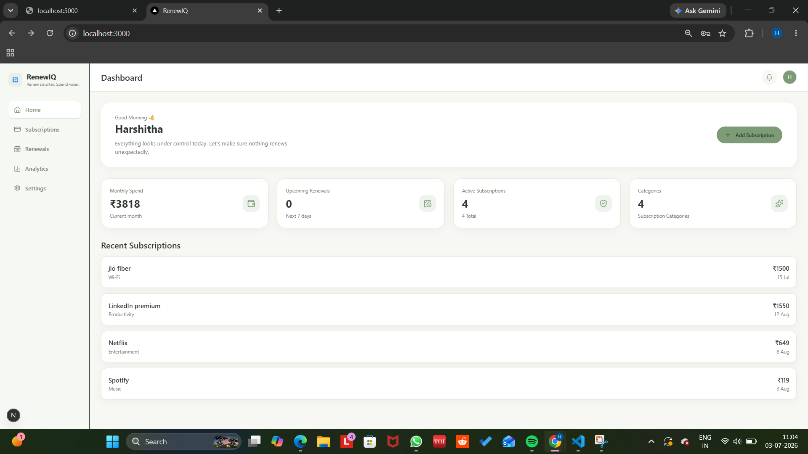

---

### 🔔 Renewals
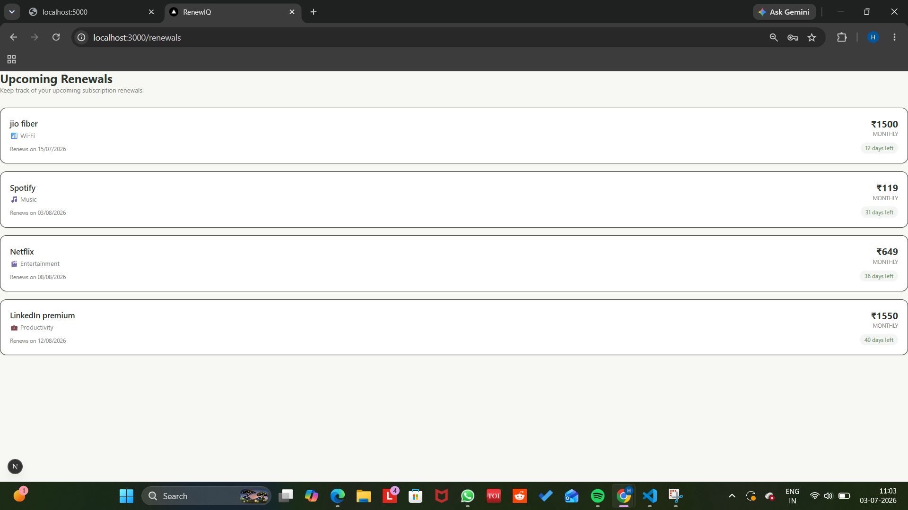

---

### 📈 Analytics
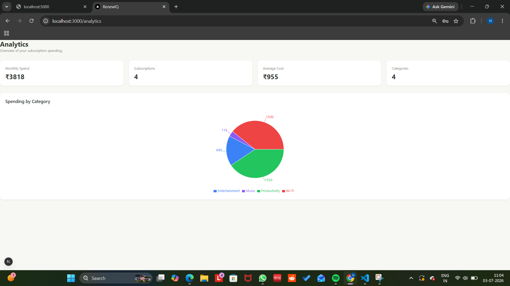

---

### ⚙️ Settings
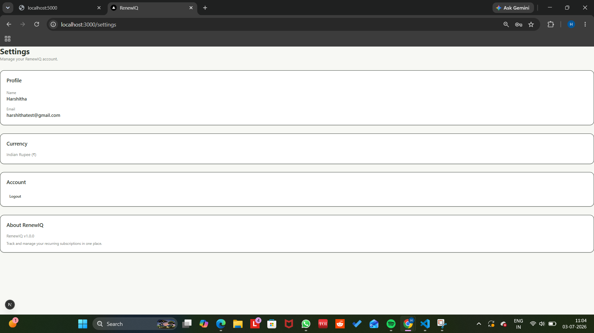


## 🚀 Getting Started

### Clone the repository

```bash
git clone https://github.com/harshithasundar/renewiq.git
```

### Frontend

```bash
cd client
npm install
npm run dev
```

### Backend

```bash
cd server
npm install
npm run dev
```

---
## 🏗 Architecture

```text
                    ┌─────────────────────┐
                    │     Next.js App     │
                    │  React + TypeScript │
                    └──────────┬──────────┘
                               │
                     Axios + JWT Token
                               │
                    ┌──────────▼──────────┐
                    │    Express Server   │
                    │ REST API + JWT Auth │
                    └──────────┬──────────┘
                               │
                           Prisma ORM
                               │
                    ┌──────────▼──────────┐
                    │    PostgreSQL DB    │
                    └─────────────────────┘
```

## 🚀 RenewIQ Workflow

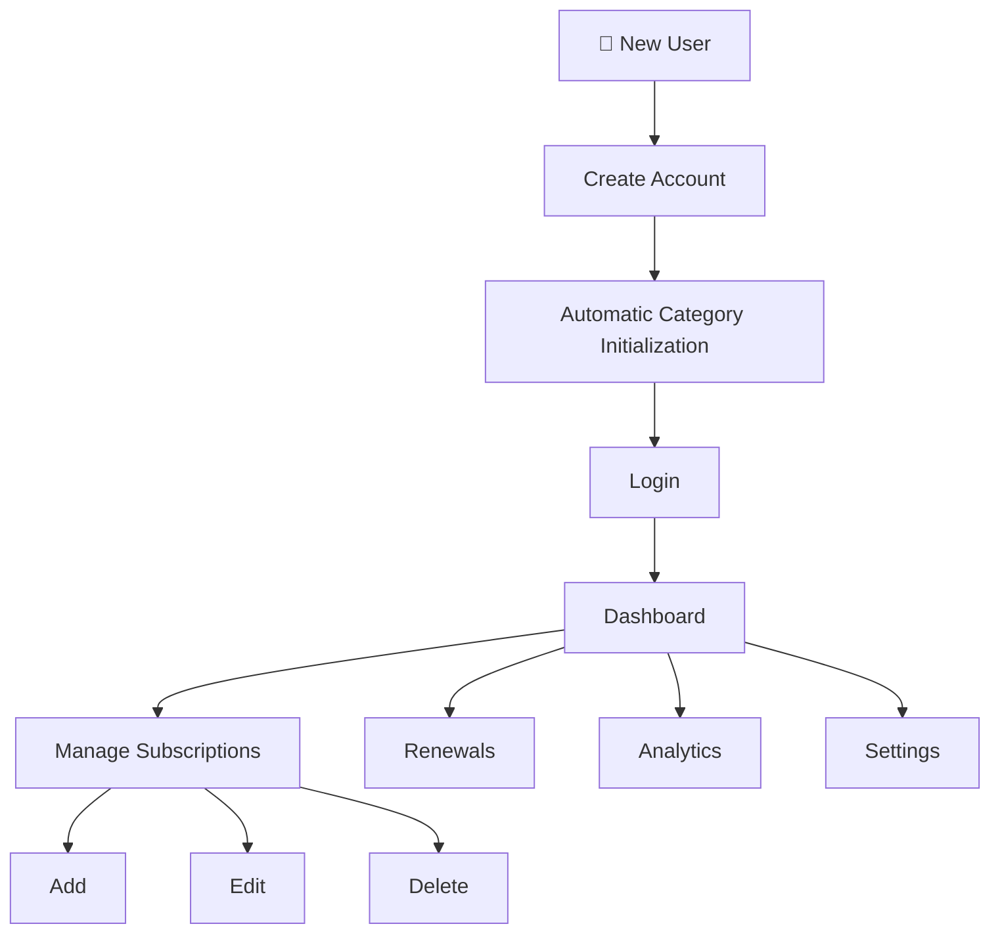

## 🔮 Future Improvements

- AI-powered subscription insights
- Email renewal reminders
- Budget tracking
- Calendar integration
- Dark mode
- Cloud deployment

---

## 👩‍💻 Author

Harshitha Sundar


## 🌟 Acknowledgements

This project was designed and developed to strengthen full-stack development skills using modern technologies including Next.js, Express, Prisma, PostgreSQL, and JWT authentication.

Every feature was built with the goal of creating a practical, scalable, and user-friendly application.

Contributions, suggestions, and feedback are always welcome.

Feel free to fork the repository, create an issue, or submit a pull request.
